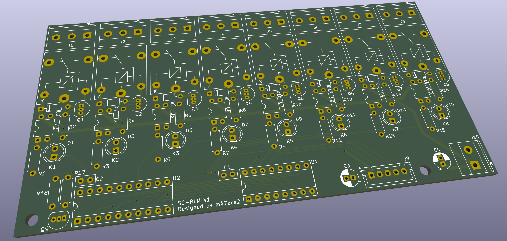
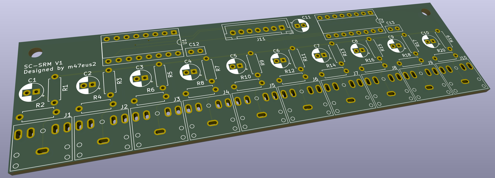
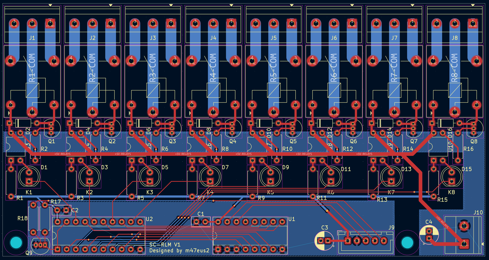
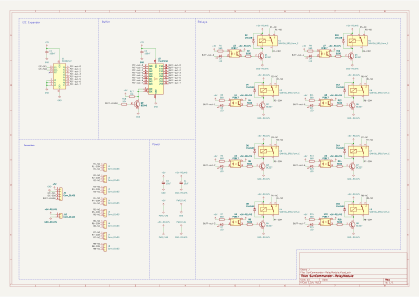
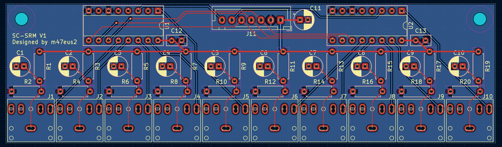
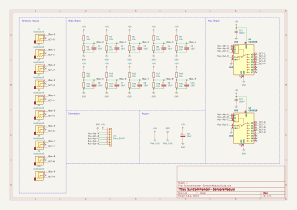

# SunCommander-PCB

PCB boards for energy optimalization device. Contactors control for power switching with full optical isolation. Multiple current measurments made with current transformers.

## Relay Module
Complete 8 relay module (230V 10A) controlled by I2C with full optical isolation and separate power source for relays coils
- Relay control with full optical isolation (with PC817 optocouplers), separate power sources and LED signalization
- Optocouplers controled by I2C pin expanders (PCF8574N) and inverting digital buffers beetween
- Conntcts to MCU with power supply, I2C bus and buffer enable signal. Requires separate 5V power supply for relays coils control
- High current terminal blocks

## Sensor Module
Helps measuring currents from 10 current transformers
- Connects to MCU with power supply, multiplexers address pins and 2 analog signals from 2 out of 10 choosen current sensors
- Muxing signals from each sensor by two CD4051 analog multiplexers to MCU
- Creates biases for current measurments
- Current transformers jack 3.5mm sockets with custom footprints

